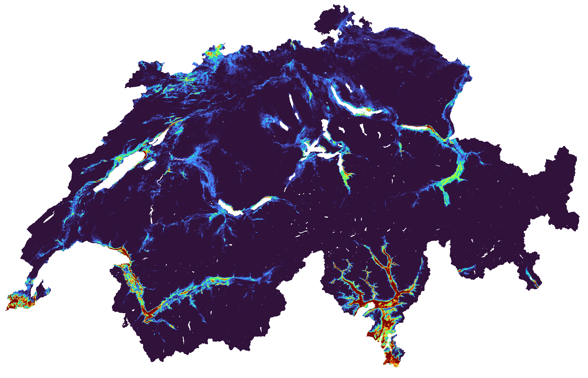

# Ecological connectivity analysis for Switzerland

<div align="center">
    
</div>

---

This repository contains the code used to assess the contribution of a pixel to the ecological connectivity at the Swiss landscape level, within the context of the [SPEED2ZERO](https://speed2zero.ethz.ch/en/) project.

The importance of a pixel for supporting ecological connectivity is evaluated by quantifying how a marginal change in habitat quality and/or permeability affects the overall ecological connectivity of the landscape for a certain taxonomic group. This marginal change is called [quality or permeability *elasticity*](https://en.wikipedia.org/wiki/Elasticity_(economics)#Definition). These elasticities are calculated with the JAX library [`jaxscape`](https://github.com/vboussange/jaxscape).

Maps obtained at the taxonomic group level are aggregated groups to obtain a single **importance index for ecological connectivity**.


> Aggregated importance index for ecological connectivity at 25m resolution. Higher values indicate higher contribution of the pixels for overall ecological connectivity, implying larger loss of connectivity if the pixel's ecological quality or permeability is degraded.

A manuscript detailing the approach will be available soon.


## Requirements

#### Hardware
A JAX compatible GPU is to be prefered.

#### Dependencies
To install the dependencies, make sure you have conda (or mamba), go to `python/` and run
```
conda env create --file environment.yml --prefix ./.env
```

#### Input data

The analysis depends on mean suitability maps for each taxonomic group considered. This data must be downloaded from [this Zenodo archive]() and placed under `data/raw`. The species maps from which the mean suitability maps have been derived, together with the mean dispersal range used for the calculation of ecological proximity, are stored in each `.nc` file attributes.

Access to the individual species distribution maps used to generate the mean suitability maps for each taxonomic group, along with individual species dispersal range data, is restricted but may be considered upon request.

## File description
- `python/biodiv_layer/group_elasticity_*.py`: Calculate (pemerability/quality) elasticities at the taxonomic group level. 
- `group_summed_elasticities`: Aggregates elasticities to calculate the importance index for ecological connectivity.
- `src/*`: Utility functions.

## Results
Elasticity maps and the aggregated importance index map are placed under `data/processed/HASH/` and are hosted under [this Zenodo archive](). 